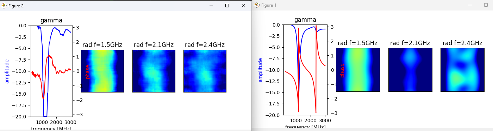
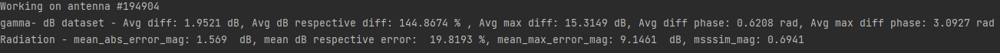
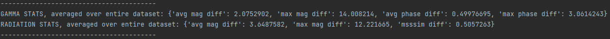
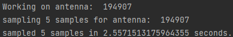
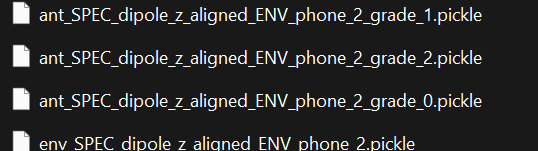
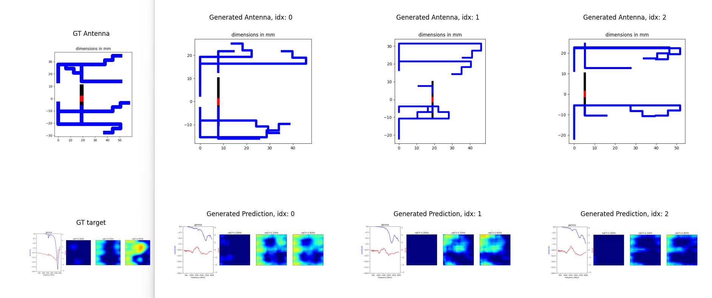

# AntenNITS
Antenna design based on Neural Inverse Transform Sampler (https://proceedings.mlr.press/v162/li22j).

This project is a solution to the problem of designing antennas with specific spec.
The project uses conditional version of NITS to generate samples from the prior distribution of the antenna parameters that match the desired spec.

# Environment Setup
Using conda is recommended for setting up the environment.
1. Create a new conda environment with 3.11 python version, using the following command:\
for example, let's name the environment "antenna":\
``` conda create --name antenna python=3.11 ```
2. Activate the environment:\
``` conda activate antenna ```
3. cd to the project directory:\
``` cd /PATH/TO/PROJECT/AntenNITS_gen2 ```
4. Install the required packages:\
``` pip install -r requirements.txt ``` 

# Data
The project expects the data to be in the following format:

|-- processed_data_130k_200k/
-  |-- 130000/
   - |-- antenna.npy
   - |-- environment.npy
   - |-- gamma.npy
   - |-- radiation.npy
   - |-- radiation_directivity.npy
     
-  |-- 130001/
   - ... same as above
-  |-- EXAMPLE/
   - |-- ant_parameters.pickle
   - |-- model_parameters.pickle
-  |-- ant_scaler.pkl
-  |-- env_scaler.pkl
-  |-- checkpoints/
   - |-- forward_best_dict.pth
-  |-- checkpoints_inverse/
   - |-- ANT_model_lr_0.0002_hd_512_nr_8_pd_0.9_bs_12_drp_0.31_bounds_-3_3.pth

## Data Description
1. **Data folders (130000,130001,...)** - contain the data. The numbers represent the ID of each antenna. Each sample contains:
   1. Description of the antenna in antenna.npy
   2. The environment of the antenna in environment.npy
   3. Radiation (of the antenna in the environment) in terms of gain (in dB) in radiation.npy
   4. Radiation in terms of directivity (in dB) in Radiation_directivity.npy
   5. S parameter (in dB) in gamma.npy
   * **note**: Both radiation and S parameter are represented as a concatenation of the magnitude and then the phase.
2. **ant_scaler.pkl & env_scaler.pkl** - metadata to standardize the antenna and environment representation, respectively.
See details on how they are generated in the **Usage** section.
3. **checkpoints** folder - The path where forward model's weights are saved. Contains forward_best_dict.pth
which is a pre-trained weights for the model.
4. **checkpoints_inverse** folder - The path where inverse model's weights are saved. Contains ANT_model_lr_0.0002_hd_512_nr_8_pd_0.9_bs_12_drp_0.31_bounds_-3_3.pth
pre-trained weights for the inverse model.\
Moreover, this is the folder where generated antennas are saved into by default.
5. **EXAMPLE folder** - 
An auxiliary folder for ```utils.py``` in order to deal with the original representation of the model, as
defined in the CST model interface. **Has no impact**, has it was moved to the repository to avoid complications.
See further details in the **Repository Description** section.

# Repository Description
This section breaks down the repository with some explanation about the files.
## AntennaDesign/
An upgraded version milestone 2. Main responsibility of this folder is:
- Define the forward model.
- Define the loss functions for the forward model.
- ```utils.py```, which is the super important file, which is responsible for:
   - data loading for training and evaluation
   - statistics 
   - original model/CST interface utility functions (validity function, representation conversion, etc.)
   - raw data processing
   - regular utility functions (linear to dB conversion for S parameter and radiation, vice versa, etc.)
### EXAMPLE/
An auxiliary folder for ```utils.py``` in order to deal with the original representation of the model, as
defined in the CST model interface.
### models/
The architecture of the forward model and its submodules. Main forward module is in ```forward_GammaRad.py```.
### losses.py
All the losses for the forward model. Main forward model loss is expressed in the class ```GammaRad_loss```.
### utils.py
described above.
## nits
All the modules for NITS, including ```antenna_condition.py``` which is part of the modification for conditioning 
the spectrum on the network.
## notebooks
Here we have all the main scripts, which are detailed in the Usage section

# Usage
All the scripts that needs to be executed are in **notebooks** folder in this project.\
Each script contains an argument parser with explanation over the arguments.

- **Important note**: Make sure that the data has the same hierarchy as described above. **Unzip the data if it is compressed.**

## process_data.py
Takes the original data, as it is provided from the data generator (CST) and returns the processed data,
represented with numpy. processing the antenna and environment data automatically generates ant_scaler and env_scaler.
## forward_model_train_main.py
Trains the forward model. Saves in ```checkpoints``` the best weights of the model,
as well as temporary weights (after every multiple epochs)
### general flow:
1. Change the default value for ```data_path``` in the function ```arg_parser()``` to YOUR_DATA_PATH, or use the parameters 
in the run configuration of this file in order to override the default data_path to YOUR_DATA_PATH (when YOUR_DATA_PATH is the local directory of the data)
2. run the script.
3. When script finished running, forward model weights are saved by default in YOUR_DATA_PATH\checkpoints\forward_best_dict.pth .

## forward_model_evaluate_main.py
Evaluates the forward model. Enables to plot visual result of the forward model, and also generate statistics for the error.
### general flow:
1. Change the default value for ```data_path``` in the function ```arg_parser()``` to YOUR_DATA_PATH, or use the parameters  
in the run configuration of this file in order to override the default data_path to YOUR_DATA_PATH (when YOUR_DATA_PATH is the local directory of the data)
2. Change the default value for ```checkpoint_path``` in the function ```arg_parser()``` 
(by default, should be changed to YOUR_DATA_PATH\checkpoints\forward_best_dict.pth)
3. run the script.
- **notes**:
   - There is a flag for the visualization, ```plot_GT_vs_pred```, which is True by default.
     - if the flag is true: for every evaluated example, a visualization of the prediction VS GT of the spectrum will be shown:\
     \
     you can see figure 1 (right), which is the GT, and figure 2 (left), which is the prediction. Both include magnitude (blue) and
     phase (red) for S parameter and the magnitude of the radiation at 3 different frequencies (1.5, 2.1, 2.4 GHz).
     - if the flag is false: No visualization will be shown
   - In any case above, statistical analysis of the prediction VS GT of the spectrum **per example** will be printed:\
  
   - In any case above, mean statistical analysis of the prediction VS GT of the spectrum **over all the loaded data** will be printed:\
  
## inverse_model_train_main.py
Trains the inverse model. Saves in ```checkpoints_inverse``` best weights of the model,
as well as temporary weights (after every multiple epochs)
### general flow:
1. Change the default value for ```data_path``` in the function ```arg_parser()``` to YOUR_DATA_PATH, or use the parameters 
in the run configuration of this file in order to override the default data_path to YOUR_DATA_PATH (when YOUR_DATA_PATH is the local directory of the data)
2. run the script.
3. When script finished running, inverse model weights are saved by default in YOUR_DATA_PATH\checkpoints_inverse\ANT_model_lr_{lr_val}_hd_{hidden_dim_val}_.. .pth.
when file's name is changed w.r.t. certain configurable parameters.

## inverse_model_generate_samples_main.py
Generates antennas given a trained inverse model and a dataset. It saves the samples in a
numpy format into ```checkpoints_inverse/samples``` by default.
### general flow:
1. Change the default value for ```data_path``` in the function ```arg_parser()``` to YOUR_DATA_PATH, or use the parameters  
in the run configuration of this file in order to override the default data_path to YOUR_DATA_PATH (when YOUR_DATA_PATH is the local directory of the data)
2. Change the default value for ```checkpoint_path``` in the function ```arg_parser()``` 
(by default, should be changed to YOUR_DATA_PATH\checkpoints_inverse\ANT_model_lr_0.0002_hd_512_nr_8_pd_0.9_bs_12_drp_0.31_bounds_-3_3.pth,
which is provided in the dataset).
- **notes**:
  - The script prints to the console the status of the generation:\
  
  -  It saves the samples in a numpy format into ```checkpoints_inverse/samples``` by default. Each file is saved with the name ```sample_{ANT_ID}.npy```
  - You can also load separate test dataset using the argument ```test_path```.
    - If test_path is not specified, samples will be generated using the validation loader
    - If test_path is specified, samples will be generated using the test loader.
        - In this case, it's important to define the test dataset using the same hierarchy as the dataset
          (test_dataset, inside it the examples, and inside each example should the same files in numpy format)
## inverse_model_evaluate_main.py
Uses the samples generated from inverse_model_generate_samples_main script in order to evaluate visually and statistically (using the forward model) 
the  generated samples. Moreover, it transforms the samples from numpy to the format that specified in the simulation,
which allows to evaluate the samples with exact simulator, to produce exact evaluation later on.
### general flow:
1. Change the default value for ```data_path``` in the function ```arg_parser()``` to YOUR_DATA_PATH, or use the parameters 
in the run configuration of this file in order to override the default data_path to YOUR_DATA_PATH (when YOUR_DATA_PATH is the local directory of the data)
2. Change the default value for ```forward_checkpoint_path``` in the function ```arg_parser()``` 
(by default, should be changed to YOUR_DATA_PATH\checkpoints\forward_best_dict.pth)
3. (Optional) - Change the default value for ```samples_folder_name```, which is ```samples```. **Change it only if
you wish to evaluate samples from another folder (this folder has to be inside ```YOUR_DATA_PATH\checkpoints_inverse```)**
4. (Optional) - Change the default value for ```output_folder_name```, which is ```generated_antennas```. **Change it only if
you wish to dump generated antennas for the CST run to another folder (this folder has will be inside ```YOUR_DATA_PATH\checkpoints_inverse```)**
5. run the script.
6. When script is running, **for every example (spectrum+environment)** top 3 antennas that were chosen to be the best solutions are saved in the output folder
**in the original representation of the data**, in order to run in with CST. In addition, the environment is also saved:\
\
- **notes**:
   - There is a flag for the visualization, ```plot_GT_vs_pred```, which is True by default.
     - there is a coupling between the visualization and the generated antennas solution dumping, meaning that if the flag is True, 
     there will be both the visualization and the dumping, but if the flag is False neither will be executed.
     - if the flag is true: for every evaluated example, a visualization of the prediction VS GT of the spectrum and generated antennas will be presented:\
     \
     you can see figure 1 (first column from left), which is the GT antenna and the desired specturm, and figure 2 (the 3 other columns),
     show the representation of the generated antennas, and their spectrum, based on the forward model. Spectrums include magnitude (blue) and
     phase (red) for S parameter and the magnitude of the radiation at 3 different frequencies (1.5, 2.1, 2.4 GHz).
   - In any case above, statistical analysis (based on forward model's results) of the prediction VS GT of the spectrum **per example** will be printed.
   - In any case above, mean statistical analysis (based on forward model's results) of the prediction VS GT of the spectrum **over all the loaded data** will be printed.
   - You can also load separate test dataset using the argument ```test_path```.
    - If test_path is not specified, samples will be evaluated using the validation loader
    - If test_path is specified, samples will be evaluated using the test loader.
        - In this case, it's important to define the test dataset using the same hierarchy as the dataset
          (test_dataset, inside it the examples, and inside each example should the same files in numpy format)

# General Important Notes:
- It is recommended to work with PyCharm.
- Mark ```AntennaDesign``` folder as Source root to use it as a starting point for resolving imports.\
That is done in PyCharm by right-click on the folder, then **Mark Directory as --> Sources root**
- The current project loads gain for the radiation, but it can be easily modified in ```AntennaDataSet.load_antenna``` method
in ```utils.py``` to directivity by loading the appropriate file.